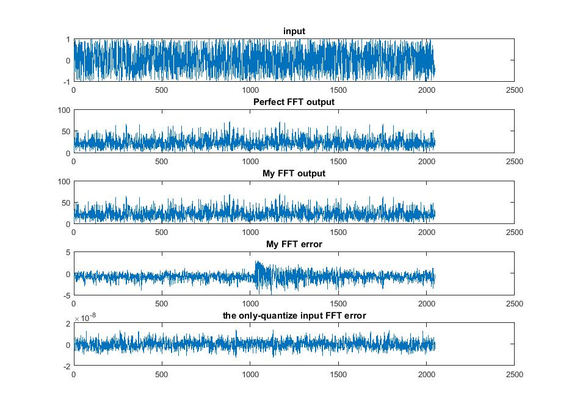
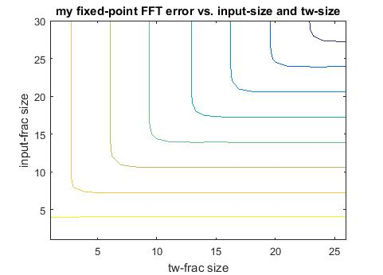

# intro
A fixed-point.cpp that was complied by matlab mex, so that realistic-fixed-point fft can be simulated as fast as the built-in matlab fft() function.

# detailed implementation
You can config the number-of-bit for input number and twiddle-factors. Currently, 

$$number_of_bit = integer_bit + fraction_bit$$

integer-bit represents the bits before the decimal, whereas fraction-bit shows the one after. For twiddle factor, as the range is always [-1, 1], the integer-bit is always 2, and the user may specify the fraction-bit as you like. For input number, a 3+5 bit input example 010.01100 represents 2+0.25+0.125=2.375.

The FFT is implemented with decimated-in-time fft (see below for 8-point example):


Internally, after each addition, the number is right-shifted by one, to avoid wordlength increase. The same is done for the twiddle factor multiplication (right shift by frac-twiddle-size). Therefore, the wordlength within the intern FFT is always kept the same. This minimize hardware cost for the real-hardware we want to model. 


# user's guide
## requirements
64-bit Matlab with license
  * signal_toolbox (bitrevorder)
  * optional: fixed_point_toolbox, just to show the difference againt naive implementation. This is not mandantory.

## file structure
* src
  * demo.m (a run-me demo)
  * fix_fft2k.m (2k fixed-point fft, that uses the mex files)
  * fix_fft.(mexa64, mexw64) the core fix_fft function
  * fix_fft.cpp source file that was compiled into the mex files

## usage
run demo.m. It will call fix_fft2k.m, a 2k fft instance. 

You can modify the fix_fft2k.m into other FFT size you want. Currently, it is verifed only for power-of-2 fft-size. So if you are using none-power-of-2, please pads zeros. Besides, we are not using dynamical memory allocation in C++, to increase robustness (not freeing space when interrupted execution). Therefore, the maximum size is 2048. If you are looking for longer FFTs, simply change the 2048 in the cpp files, and recompile the cpp file.


# hacker's guide
## compiling
If you donot have a mex file yet, or you modified the cpp file, execute in Matlab
```matlab
mex fix_fft.cpp
```
to build a new mex file.

# outcome
The speed of the C-mex is 60ms for 1k execution of 2k fft, comapring with 40ms for 1k execution of the same-size built-in fft().

The following figure shows the example result for the FFT, for sure the error is larger (plot4) than the case where we only quantify the input and keep the rest compuation as double precesion (plot5). The difference is about 100-times, or 7-bits. This is due to the only-quantize-input method keeps intermidiate computation as double precesion, which is over-optimistic for signal processing hardwares



The followig figure show the pareto points tw-frac size againt input-frac size. On each curve, the rms error is the same. Obviously, right-upper curves denotes less error. It generally tells that, the word-width of the input should be 5-bit wider than the twiddle factors. Otherwise one of them becomes the bottleneck for error.


